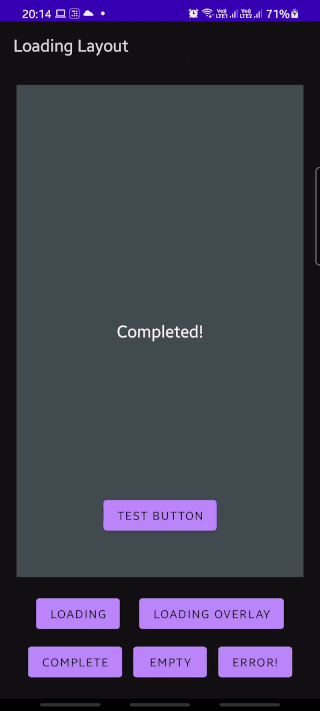

# Loading Layout for Android



Loading layout is a container view that manages easy switching between loading, completed and other
states of your screen with a single line. It takes away the boilerplate of setting `view.setVisibility`
on all your various views when the state of your screen transitions between loading/loading overlay/
completed/error/empty states.

## Usage

1. Add it to your XML layout and add in your various layouts as direct children of `LoadingLayout`.
2. Make sure to add in `android:tag`s to your elements corresponding to what you'd like them to represent:


Layout type | `android:tag`
------------ | -------------
Complete | `@string/ll_complete`
Loading | `@string/ll_loading`
Empty (optional view) | `@string/ll_empty`
Error (optional view) | `@string/ll_error`

Your layout should end up looking something like this: 

```xml
<com.valartech.loadinglayout.LoadingLayout
        android:layout_width="match_parent"
        android:layout_height="match_parent"
        >

        <!--  Empty      -->
        <TextView
            android:tag="@string/ll_empty"            
            ...
            />

        <!--   Loading     -->
        <ProgressBar
            android:layout_width="wrap_content"
            android:layout_height="wrap_content"
            android:layout_gravity="center"
            android:tag="@string/ll_loading" />

        <!--   Completed     -->
        <FrameLayout
            android:layout_width="match_parent"
            android:layout_height="match_parent"
            android:tag="@string/ll_complete">
          ...
        </FrameLayout>

        <!--    Error    -->
        <TextView
            android:layout_width="match_parent"
            android:layout_height="match_parent"
            android:tag="@string/ll_error"
            android:text="@string/error"
            />
    </com.valartech.loadinglayout.LoadingLayout>
```   

3. You can now call `loadingLayout.setState()` to show/hide views!  

## Adding to your project

[]

```groovy
allprojects {
    repositories { //not under buildscript
        jcenter()
        maven { url "https://jitpack.io" } 
    }
}

dependencies {
    implementation "com.valartech:loading-layout:${version}"
}
```


If you want to use the snapshot version, you can use this instead:
```groovy
implementation "com.valartech:loading-layout:master-SNAPSHOT"
```
instead, and adding the following to your module `build.gradle`:
```groovy
configurations.all {
    // Check for updates every build for SNAPSHOTs
    resolutionStrategy.cacheChangingModulesFor 0, 'seconds'
}
```

## Custom XML attributes

Attribute | Description
------------ | -------------
`default_state` | Initial state of the view. Defaults to `complete`.  
`overlay_tint` | Colour of the overlay tint. Defaults to 50% transparent black.  
`cross_fade_success` | Enable cross-fade animation when transitioning `loading` -> `complete`. Defaults to `true`  

## Tips 
- You're free to use a single view (like a `ProgressBar`) or a container of views(like a `ConstraintLayout`)
as a child of the `LoadingLayout`. 
- The `LOADING_OVERLAY` is a special state that shows the `loading` state over the `completed` state,
with a tint applied over it. It also prevents button clicks from reaching the `completed` layout.
- Use `tools:default_state` to quickly check how different view states would look within your layout.

## Caveat
This library does add in an extra view into your layout hierarchy, and would thus cause a slight hit 
in performance. We have not seen this be a noticeable issue in our apps even on complex views, but use
as per your discretion on deeply nested layouts.   
